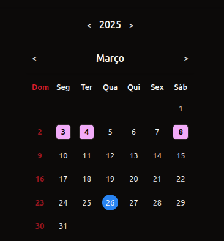
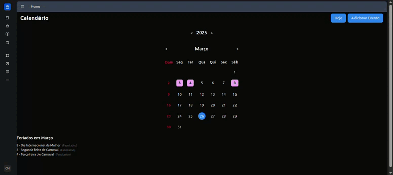
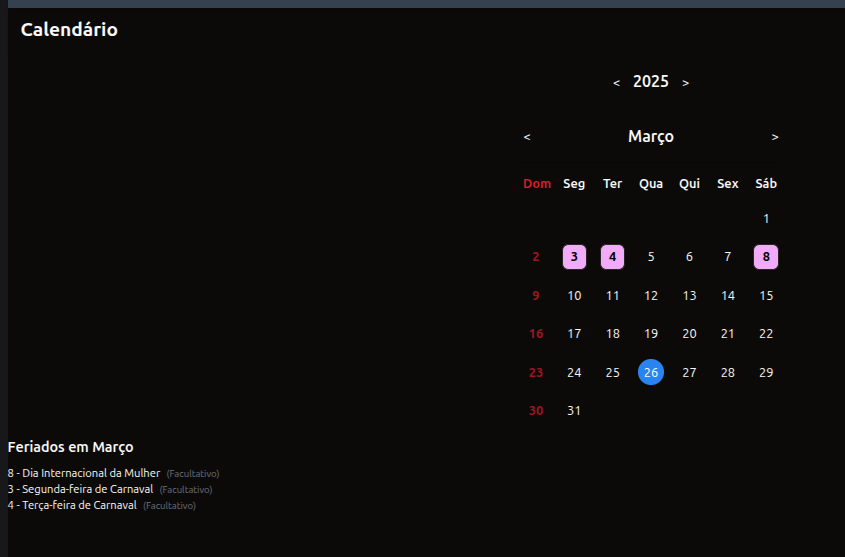

# MVP CVT App - Calendário Dinâmico

Aplicativo Next.js que oferece um calendário dinâmico com suporte a feriados nacionais brasileiros. O calendário ajusta automaticamente os dias de acordo com o mês selecionado e destaca feriados e datas especiais.



## Funcionalidades

- **Calendário Dinâmico**: Navegação entre meses e anos com reorganização automática das semanas
- **Destaque para Domingos**: Dias de domingo são exibidos em vermelho
- **Feriados Nacionais**: Suporte para feriados fixos e móveis do calendário brasileiro
- **Interface Responsiva**: Design adaptável para diferentes tamanhos de tela



## Estrutura do Projeto

```
src/
├── app/             # Páginas e rotas da aplicação
├── components/      # Componentes reutilizáveis da UI
└── lib/
    └── calendars/   # Lógica do calendário e feriados
```

## Configuração de Feriados

O sistema suporta feriados nacionais fixos e móveis (como Carnaval e Páscoa) através de uma API interna.

```typescript
// Exemplo de uso
const feriados = getTodosFeriados(2025, ['nacional', 'facultativo']);
```



## Começando

Primeiro, instale as dependências:

```bash
npm install
# ou
yarn install
# ou
pnpm install
```

Em seguida, execute o servidor de desenvolvimento:

```bash
npm run dev
# ou
yarn dev
# ou
pnpm dev
# ou
bun dev
```

Acesse [http://localhost:3000](http://localhost:3000) no navegador para ver o resultado.

## Tecnologias

- [Next.js](https://nextjs.org/) - Framework React
- [Tailwind CSS](https://tailwindcss.com/) - Framework CSS
- [TypeScript](https://www.typescriptlang.org/) - Superset JavaScript tipado

## Próximos Passos

- [ ] Adicionar eventos personalizados ao calendário
- [ ] Implementar visualização semanal e diária
- [ ] Adicionar sincronização com Google Calendar

## Mais Informações

Para saber mais sobre as tecnologias utilizadas:

- [Documentação do Next.js](https://nextjs.org/docs)
- [Tailwind CSS](https://tailwindcss.com/docs)
